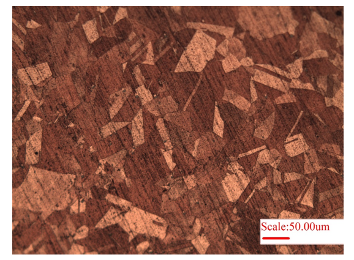
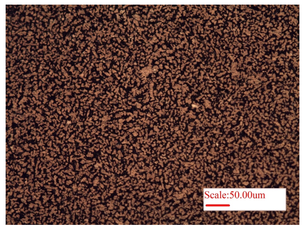
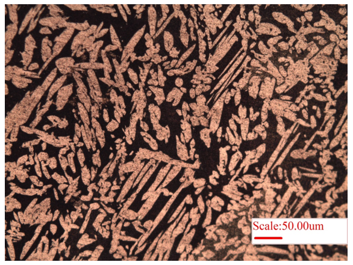
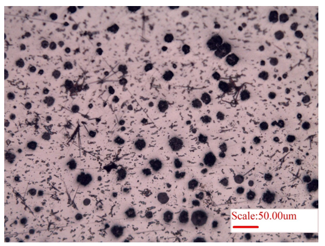
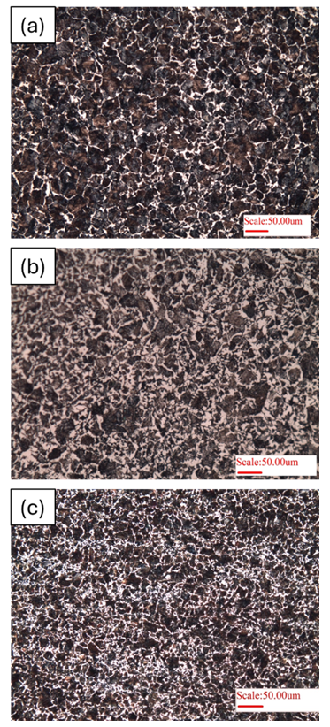

Microstructure is an internal structure of material that can be visualized using optical microscope. As the revelation of phases, grain size, defects/porosity in the material is evidently captured, its observation can provide insights into the material performance and properties, and also highlight the source of defect say in the starting material, during manufacturing, or processing, or even during service. Microstructure is key attribute of determining material properties, i..e strength, ductility, hardness, toughness, etc.   

The <b>phases</b>  in a microstructure exist with distinct properties, and their content and distribution greatly influence material properties. Thus, microstructure assessment must pay attention to the phases present in the material. In some materials, only one (or single) phase may exist as well. Further, <b> grain size </b> is also very important role in dictating material strength, ductility and corrosion resistance. Finer grain size are typically preferred to provide a stronger material complemented with superior ductility. <b> Defects </b> in the microstructure result from during any stage of material synthesis to its usage. Example of defects include porosity, dislocations, inclusions, impurities, un-melted particles etc. Defects typically aggravate the stress on material and ensue early failure.   

As microstructure plays an dominant role in the design of material for any application, thus its understanding provides a peek into the material for being able to extract the best performance by optimal material selection, design, processing and characterization. Various techniques, such as alloying, thermos-mechanical treatment (i.e. utilizing heat-treatment and/or mechanical treatment), one can alter the material performance for specific engineering needs. Accordingly, microstructure observation can provide suitability of material for aerospace, automotive, biomedical, electronic, and space applications.  

In order to reveal the microstructure, various chemical etchants (or sometimes thermal treatments) are utilized. A few common chemical etchants for revealing the grains are provided in Table 1.  

Table 1: Common chemical etchants for revealing grain boundary/ second phases during metallography of a polished sample (of selected materials). 

| **S. No.** | **Material**       | **Etchant**                                                                                                                                                          |
|-------------|--------------------|----------------------------------------------------------------------------------------------------------------------------------------------------------------------|
| 1 | **Mild Steel** | Nital (100 mL ethanol, 1–10 mL Nitric Acid) for revealing ferrite and ferrite–carbide interfaces    - Picral (100 mL ethanol, 2 g Picric acid) |
| 2 | **Cast Iron** | Nital (100 mL ethanol, 1–10 mL Nitric Acid) |
| 3 | **Copper** | 30 mL HCl, 10 g FeCl₃, 120 mL Water or ethanol |
| 4 | **Aluminium** | 10 mL H₃PO₄ (85%), 90 mL Water |
| 5 | **Nickel** | 1 part HNO₃ (conc), 1 part Acetic acid (glacial)    - 7.5 mL HF, 2.5 mL HNO₃, 200 mL methanol |
| 6 | **Titanium** | 10 mL HF, 25 mL HNO₃, 45 mL glycerin, 20 mL Water    - 2 mL HF, 98 mL Water |
| 7 | **Magnesium** | 0.6 g Picric acid, 10 mL Ethanol (95%), 90 mL Water    - 2 mL HF (48%), 2 mL HNO₃ (conc.), 96 mL Water |
| 8 | **Brass** | 100 mL distilled Water, 50 mL Nitric acid, 8 mL Sulfuric acid, 7.5 g Ammonium chloride, 40 g Chromium (VI) oxide |
| 9 | **Inconel** | 20–30 mL distilled Water, 0–20 mL HNO₃, 20 mL HCl, 10 mL H₂O₂ (30%) *(concentration variable)* |
| 10 | **Stainless Steel** | 5–10 mL Hydrochloric acid (35%), 1–3 mL Selenic acid, 100 mL Ethyl alcohol (95%)    - HCl saturated with FeCl₃ |

<b>Materials</b> 

The microstructure of copper (Cu) is presented in Fig.1.  As pure copper is very soft, the removal of polishing scratches is not easy, and the same can be observed in the microstructure (Fig. 1). The brighter and darker regions arise because of different orientation of grains. Herein, electropolishing may be helpful in removing the scratches for better visualization of microstructure of softer materials. Consequently, brass (alloy of Cu and Zn) is harder and its microstructure is presented in Figure 2. The bright region is dendrites (alpha-phase of Zn), whereas the surrounding dark region is beta-phase (𝛽′, of Cu), Fig. 2. Further, Widmanstätten microstructure of brass is presented in Fig. 3, wherein long lath of alpha-phase (bright regions) is present within surrounding beta-matrix (𝛽′, dark-region).  

 
Figure 1: Microstructure of Copper showing the grains. Also, note the scratches in the microstructure due to softer nature of copper, which makes it very difficult to completely remove the surface damage via polishing.  

 
Figure 2: Microstructure of brass, an alloy of 60% copper and 40% zinc, showing alpha-lath structure (Zn) embedded within beta (𝛽′, Cu) matrix.  

 
Figure 3: Microstructure of brass showing Widmanstätten microstructure of brass exhibiting elongated alpha-lath structure (Zn) embedded within beta (𝛽′, Cu) matrix.  

Microstructure of nodular cast-iron is also provided as Figure 4. Herein the nodules of carbon (graphite) are typically surrounded by ferrite with remaining matrix of pearlite (which can be revealed after etching the cast iron). Typically, Magnesium is added to promote formation of graphite spheroids. Here, the purpose of presenting the un-etched microstructure (Fig. 4) is to observe the size and distribution of the carbon nodules in the cast iron.  

 
Figure 4: Microstructure showing the distribution of carbon (graphite) nodules in the nodular cast iron.  

Heat treatment plays a very important role on the development of microstructure. Herein, as received microstructure of 0.45% C steel is presented (Fig. 5a), exhibiting >90% pearlite (dark phase) with ferrite at grain boundaries (white phase). Once the material is annealed (slow furnace cooling, Fig. 5b), a near thermodynamically equilibrium microstructure is obtained (i.e. ~60% pearlite). But, normalizing heat treatment (fast air-cooling) produces a finer microstructure (but with higher pearlite content), Fig. 5c. Thus, heat treatment plays a dominant role in engineering microstructure of steels.  

 
Figure 5: Microstructure of 0.45%C steel (hypoeutectoid steel) of: a) as-received sample, b) Annealed heat-treatment, and c) normalizing heat treatment.

